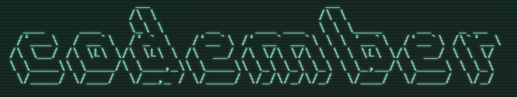

# [Codember](https://codember.dev)
Coding challenge made by [Midudev](https://github.com/midudev).

# 2023 

## Challenges


|                                |                      **Solutions**                |                                                      |
|:------------------------------:|:------------------------------------------------: |:---------------------------------------------------:	|
|        **Challenge**        	 |                        **C++**                    |                       **Python**                     |
| [Challenge 01](challenge01)  🦝| [challenge01.cc](challenge01/cpp/challenge01.cc)  | [challenge01.py](challenge01/python/challenge01.py)  |
| [Challenge 02](challenge02)  🦄| [challenge02.cc](challenge02/cpp/challenge02.cc)  | [challenge02.py](challenge02/python/challenge02.py)  |

## Run

- **C++**

    Since each challenge was made in C++23, last version of every compiler will be needed. In this case **gcc v13.2.0** was used, and it is the recommended one because not all compilers implements same features. Then, just compile and run with std flag:
     ```
    $ g++ challengeXX.cc --std=c++23 -o challengeXX

    $ ./challengeXX.exe
    ```
- **Python**

    In python just run every challenge with the interpreter:

    ```
    $ python challengeXX.py
    ```

